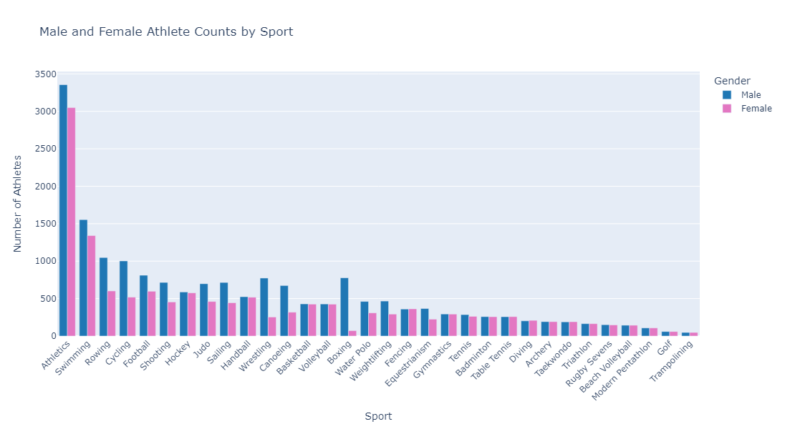
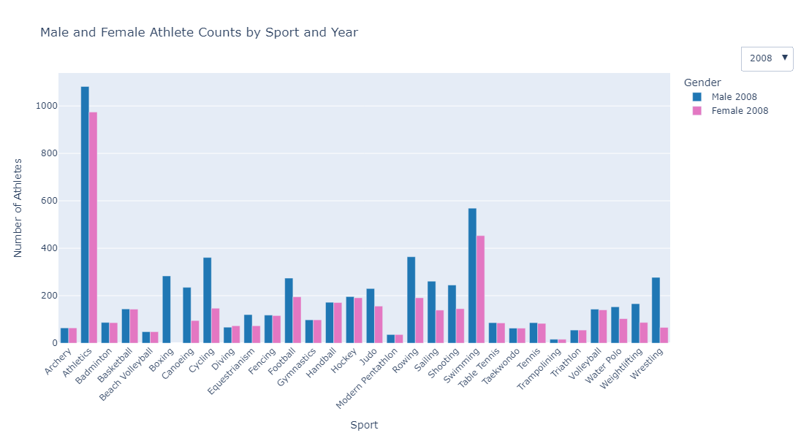
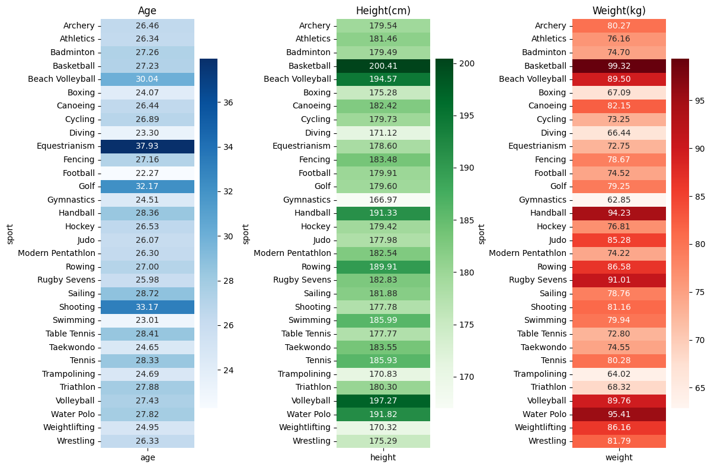
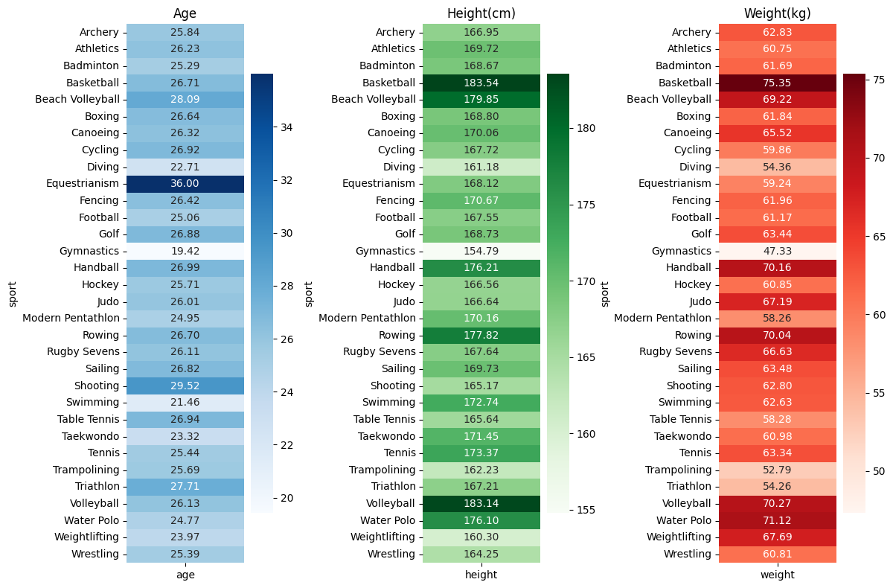
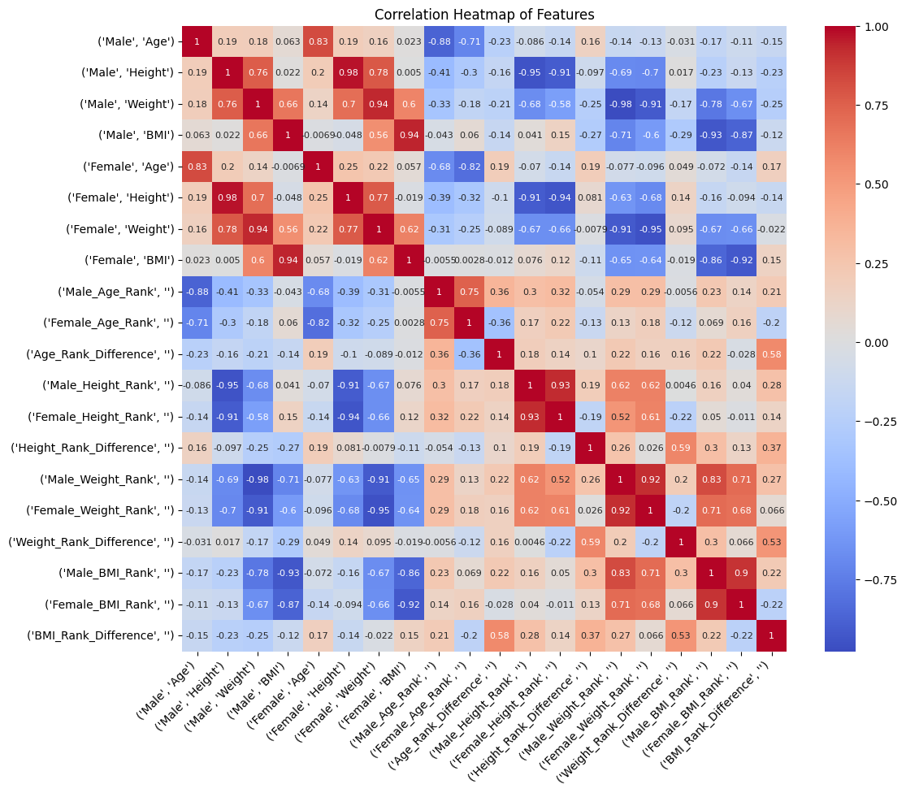
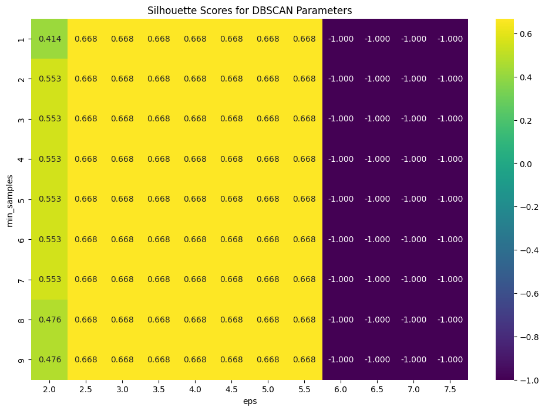
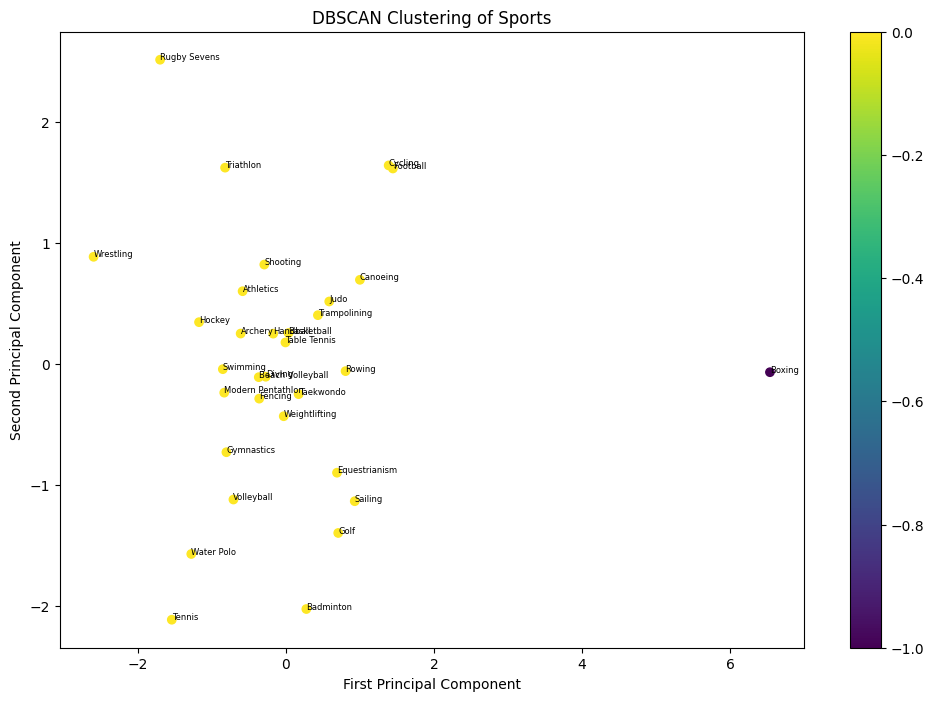
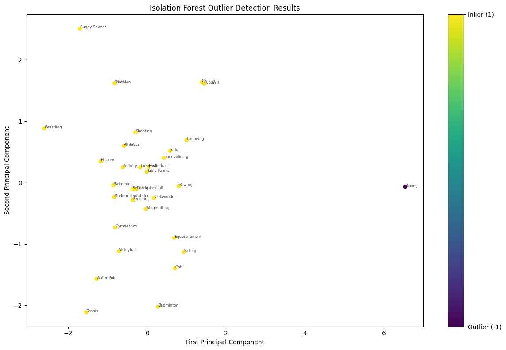
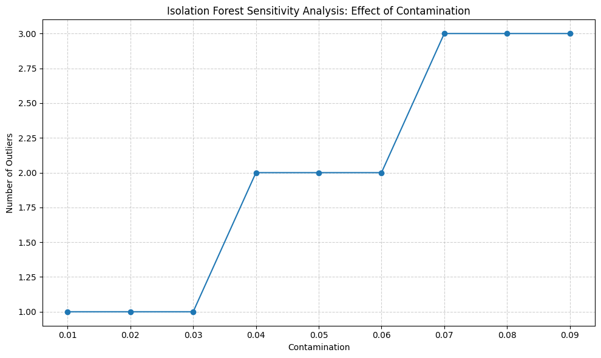
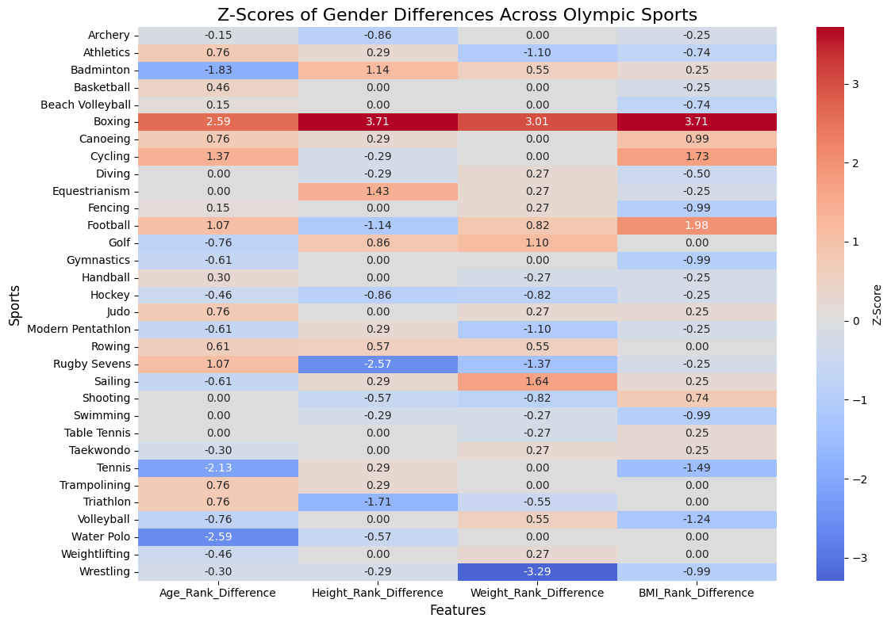

# Olympic Athletes Outlier Analysis (2008-2016)

## Description

This project analyzes Olympic athlete data from 2008, 2012, and 2016 Summer Olympics, focusing on identifying and understanding outliers in various sports comparing genders based on athletes' physical attributes.  Using advanced machine learning techniques, we explore how different sports deviate from the norm in terms of age, height, weight, and BMI characteristics of their athletes.

## Key Features

1. **Data Preprocessing**: Cleaned and prepared Olympic athlete data, handling duplicates and ensuring comparable sports across genders.

2. **Exploratory Data Analysis**:
   - Visualized athlete counts by sport and gender using interactive Plotly graphs.
   - Created heatmaps to display average age, height, weight, and BMI across sports.

3. **Feature Engineering**:
   - Calculated BMI for athletes.
   - Created rank difference features to compare male and female athletes within each sport.

4. **Outlier Detection**:
   - Application of machine learning models (DBSCAN and Isolation Forest) for outlier detection
   - Principal Component Analysis (PCA) for dimensionality reduction and visualization

## Technologies Used

- Python
- Pandas & NumPy for data manipulation
- Matplotlib, Seaborn, and Plotly for visualization
- Scikit-learn for machine learning algorithms (DBSCAN, Isolation Forest, PCA)

## Key Findings

- Significant variations in gender differences were observed across different sports for age, height, weight, and BMI.
- The analysis revealed patterns in how gender differences manifest in various Olympic sports.
- In many sports, there are physical attribute similarities regardless of gender.
- Boxing was consistently identified as an outlier sport in terms of comparing genders in multiple athletic metrics.

## Visualizations

## Data Source

[DataCamp Olympics Dataset](https://www.datacamp.com/datalab/datasets/python-olympics)
